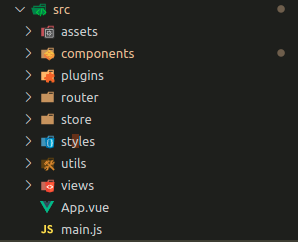

# app-roaming

## Project setup

First follow these [steps](https://github.com/GSMA-CPAS/BWRP-development-setup) and then get the [core](https://github.com/GSMA-CPAS/BWRP-UI/tree/master/webapp) to work.
Then run following commands:

```bash
$ npm install
$ NODE_ENV=production npm run build
```

Then you run get the core and call http://localhost:3000/.

**Note**

Alternatively you run the core and then start the UI with following commands (skip the first command if you have already installed dependencies):

```bash
$ npm install
$ npm run serve
```

---

## Project folder structure

## 

The components folder contains all the fundamental items.
Check out the [global components](src/components/global-components), some may be useful for development, and the [store](src/store) which holds most of the data of the application.

### Notable Libraries

[Vue](https://vuejs.org/), [Vuetify](https://vuetifyjs.com/en/) & [Vuex](https://vuex.vuejs.org/)
